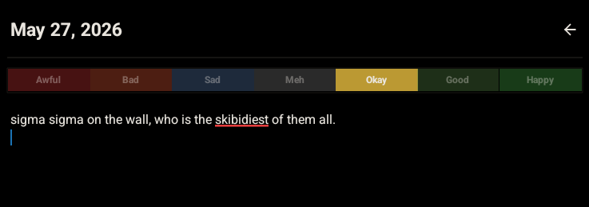

# LightButter

I made this so I could start journaling. It's a minimal journaling app made with react native and typescript.

## Preview

## How to use it

1. Clone this repo
2. `npm i`
3. `npx expo start` — scan QR with Expo Go on your phone
4. Or build: `npm i -g eas-cli && eas login && npx eas build -p android`
